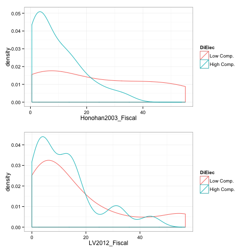
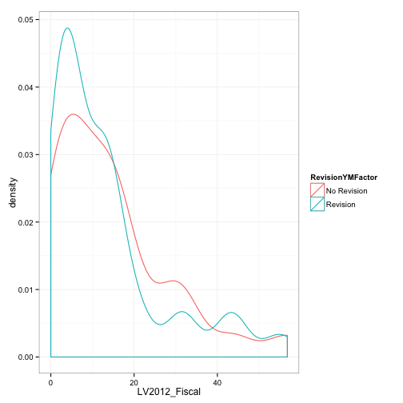
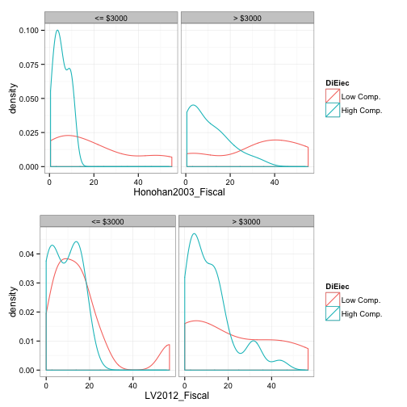

# Thoughts on Fiscal Costs Revisions

### 28 Feb. 2014

---

## Revision definition 

We looked at revisions that were made across following data sets:

- **CP**: Caprio and Klingebiel (1996) 

- **HK**: Honohan and Klingebiel (2003) (upon which Keefer (2007) is based)

- **LV**: Laeven and Valencia (2012). 

It is important to note that Honohan and Klingebiel (2003) is a subset of the larger IMF/World Bank data set where many other variables (mostly policy choices) are observed. As such, a revision is coded to occur:

- When LV has fiscal costs that are different from CP.

- When LV has fiscal costs that are different from HK, and LV was not the same as CP. (There were a number of cases where LV and CP had the same figure, e.g. the Philippines 1983, but HK had a different figure, these cases were not coded as revisions.)

- When LV had fiscal costs data that was not included in CP and the year was before 1997 (the year CP collected their data).

- When LV had fiscal costs data that was not included in HK if LV was not the same as CP.

- When LV has fiscal costs data that is not recoreded in CP.

- The start year of the crisis is different in LV compared to the other data sets.

## Number of revisions

There are 33 revisions out of about 129 crises before 2001. However, fiscal costs data is reported in any of the data sets for only 59 crises before 2001. So about  56 percent of the crises where any data is ever reported in the IMF/World Bank data sets had revised fiscal costs figures. 

## Comparing fiscal costs densities across revisions

So how do these revisions effect the fiscal costs estimates for countries with different political and economic characteristifcs?

#### Electoral competitiveness

These plots show how the distribution of fiscal costs of crises (% GDP) change between the Honohan and Kingebiel (2003) and Laeven and Valencia (2012) data sets. Note: this is only for crises before 2001.

We can see that though in the original data high and low competitiveness countries have very different distributions--high competetiveness countries tending to have low fiscal costs, they are much more similar when we use the updated Laeven and Valencia fiscal costs data. This appears to be the result of both higher fiscal costs being seen in high competetiviness countries and lower fiscal costs being seen in low competetiviness countries. 

This is why electoral competitiveness loses statistical significance when we use the updated data.

#### Fiscal costs revisions

Does this mean that electoral competitiveness is not a cause of lower fiscal costs? This is difficult to actually determine. It may be that the figures for low competetiveness countries underestimate the real costs, whereas more electorally competetive countries have more accurate numbers and these numbers become more accurate over time.

As a basic test of this theory, let's look at if estimated costs are higher for countries with a revision and those without. Again this includes only crises before 2001. 

### Income, Competitiveness, and Fiscal Cost Revisions

In separate logistic regression analysis we found that log(GDP per Capita) was a strong positive predictor of the probability of having revised data. 

## General conclusions?

What is the take away from all of this? 
